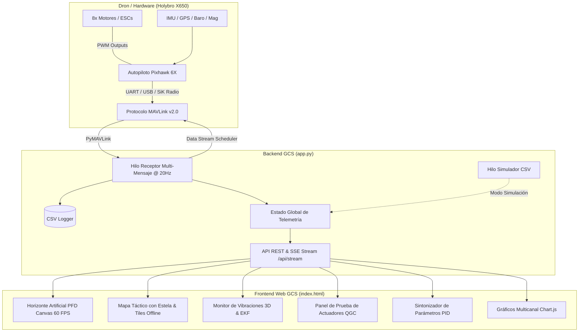

# 🚁 Estación Terrena de Telemetría & Control - Holybro X650 (Pixhawk 6X)

[](https://www.python.org/)
[](https://flask.palletsprojects.com/)
[](https://mavlink.io/)
[](https://holybro.com/products/pixhawk-6x)
[](https://holybro.com/)
[](LICENSE)
[-red.svg)](https://www.ubo.cl/)

---

## 📖 Descripción General

Este repositorio contiene la **Estación Terrena de Control (GCS - Ground Control Station)** de alto rendimiento desarrollada para la plataforma aérea no tripulada **Holybro X650** equipada con el autopiloto **Holybro Pixhawk 6X** (compatible con stacks **PX4 Autopilot** y **ArduPilot**).

Diseñada para entornos de **investigación, desarrollo y pruebas de banco**, la estación ofrece adquisición de telemetría a **20 Hz**, instrumentos de vuelo aeronáuticos primarios (PFD) en Canvas a 60 FPS, análisis de vibraciones 3D, salud del estimador EKF, sintonización de parámetros PID en caliente y un modo simulador con reproducción de logs CSV.

---

## 🏗️ Arquitectura del Sistema



---

## ✨ Características Principales

### 1. 🛩️ Primary Flight Display (PFD) Aeronáutico
- Renderizado fluido en **HTML5 Canvas a 60 FPS**.
- Escala de cabeceo (*Pitch Ladder* -80° a +80°) y arco de alabeo (*Roll Arc*).
- Cinta superior de rumbo magnético (*Heading Tape*).
- Cintas laterales de velocidad (m/s y km/h) y altitud (AGL) con indicador de velocidad vertical (*VSI*).

### 2. 🔌 Conectividad Dinámica & Streaming 20 Hz
- Escaneo automático de puertos seriales (`COM1` a `COM24`), módems de radio SiK y conexiones de simulación SITL (`udp:127.0.0.1:14550`, `tcp:127.0.0.1:5760`).
- Conexión y desconexión en caliente desde la interfaz web.
- Servidor SSE (*Server-Sent Events*) para transmisión de telemetría a 20 Hz sin sobrecarga de sondeo HTTP.

### 3. 📊 Diagnóstico de Sensores, Vibraciones 3D & EKF
- Monitor de vibraciones triaxial ($Vibe_X, Vibe_Y, Vibe_Z$) con indicadores de seguridad (<30 m/s² Normal, 30-60 m/s² Advertencia, >60 m/s² Crítico) y detección de clipping para balanceo de hélices.
- Monitoreo de varianzas del filtro EKF (velocidad, posición horizontal/vertical, brújula).
- Diagnóstico de batería con **cálculo de voltaje por celda** (3S/4S/6S), corriente y consumo en mAh.

### 4. ⚙️ Banco de Pruebas de Actuadores (QGC Style)
- Prueba independiente para hasta 8 motores mediante `MAV_CMD_ACTUATOR_TEST` (PX4) y `MAV_CMD_DO_MOTOR_TEST` (ArduPilot).
- Interruptor de seguridad maestro (*Safety Toggle*), deslizador maestro y parada de emergencia instantánea (Tecla `Espacio`).

### 5. 🎛️ Sintonizador de Ganancias PID
- Ajuste rápido de ganancias P, I, D de Roll Rate, Pitch Rate, Yaw Rate y límites de velocidad (`MPC_XY_VEL_MAX`, etc.) con guardado directo a la memoria flash del Pixhawk.
- Inspector universal de parámetros MAVLink con lectura y escritura en vivo.

### 6. 📁 Reproductor de Logs / Simulador CSV
- Reproducción paso a paso de sesiones grabadas ([telemetria_escritorio.csv](telemetria_escritorio.csv)) con control de velocidad (0.5x, 1x, 2x, 4x) para desarrollo y docencia sin hardware conectado.

### 7. 🌍 Mapa Táctico Offline
- Trazado de trayectoria continua (*breadcrumb trail*).
- Soporte para operar sin internet utilizando mosaicos locales precargados en `static/tiles/` (niveles de zoom 14 a 19).

---

## 🛠️ Especificaciones de Hardware (Holybro X650)

| Componente | Especificación |
| :--- | :--- |
| **Chasis (Frame)** | Holybro X650 Quadcopter Carbon Fiber |
| **Controlador de Vuelo** | Holybro Pixhawk 6X (STM32H753 @ 480 MHz) |
| **IMU / Sensores** | ICM-20649, ICM-42688-P, ICM-42670-P, Barómetro MS5611 |
| **GPS / Brújula** | Holybro M10 / M9N GPS + Magnetómetro IST8310 |
| **Enlace de Telemetría** | Radio Módem SiK 915 MHz / 433 MHz @ 57600 baudios o USB directo |
| **Batería Compatible** | LiPo 4S (14.8V) - 6S (22.2V) |

---

## 🚀 Instalación y Puesta en Marcha

### Prerrequisitos
- **Python 3.10 o superior**.
- Navegador web moderno (Chrome, Edge, Firefox).

### 1. Clonar el Repositorio
```bash
git clone https://github.com/Javiermoralesubo/Telemetria_Holybro_x650.git
cd Telemetria_Holybro_x650
```

### 2. Instalar Dependencias
```bash
pip install -r requirements.txt
```

### 3. Ejecutar la Estación Terrena
En Windows, puedes hacer doble clic en `run.bat` o ejecutar:
```bash
python app.py
```

Abre tu navegador en:
```
http://localhost:5000
```

---

## 📡 Referencia de la API REST

| Método | Endpoint | Descripción |
| :--- | :--- | :--- |
| `GET` | `/api/datos` | Retorna el estado consolidado de telemetría en JSON |
| `GET` | `/api/stream` | Stream continuo SSE (*Server-Sent Events*) a 20 Hz |
| `GET` | `/api/conexiones/puertos` | Lista los puertos COM y endpoints SITL detectados |
| `POST` | `/api/conectar` | Conecta al puerto/baud especificado |
| `POST` | `/api/desconectar` | Cierra la conexión MAVLink de forma segura |
| `POST` | `/api/modo/<nombre_modo>` | Cambia el modo de vuelo (ej: `POSCTL`, `ALTCTL`, `STABILIZED`, `RTL`, `LAND`) |
| `POST` | `/api/armar/<0|1>` | Arma (1) o Desarma (0) los motores del dron |
| `POST` | `/api/motor/<id>/<valor>` | Activa prueba de motor (ID 1-8, valor 0-100%) |
| `POST` | `/api/motor/stop_all` | Parada de emergencia de todos los actuadores |
| `GET` | `/api/parametro/<nombre>` | Lee un parámetro del Pixhawk |
| `POST` | `/api/parametro/<nombre>/<valor>` | Escribe un parámetro en el Pixhawk |
| `POST` | `/api/simulacion/<iniciar|detener>` | Controla el modo simulador CSV |
| `GET` | `/api/descargar_log` | Descarga el archivo CSV registrado |

---

## 📊 Estructura del Registro de Telemetría (CSV)

El archivo `telemetria_escritorio.csv` registra automáticamente:
```csv
Tiempo(s),Pitch(rad),Roll(rad),Yaw(rad),AltRel(m),Groundspeed(m/s),Voltaje(V),Corriente(A),Bateria(%),Latitud,Longitud,Satellites,ModoVuelo,VibeX,VibeY,VibeZ
```

---

## 👥 Créditos e Institución

- **Desarrollado en**: Universidad Bernardo O'Higgins (UBO)
- **Autor / Mantenedor**: Javier Morales ([@Javiermoralesubo](https://github.com/Javiermoralesubo))
- **Licencia**: [MIT License](LICENSE)
